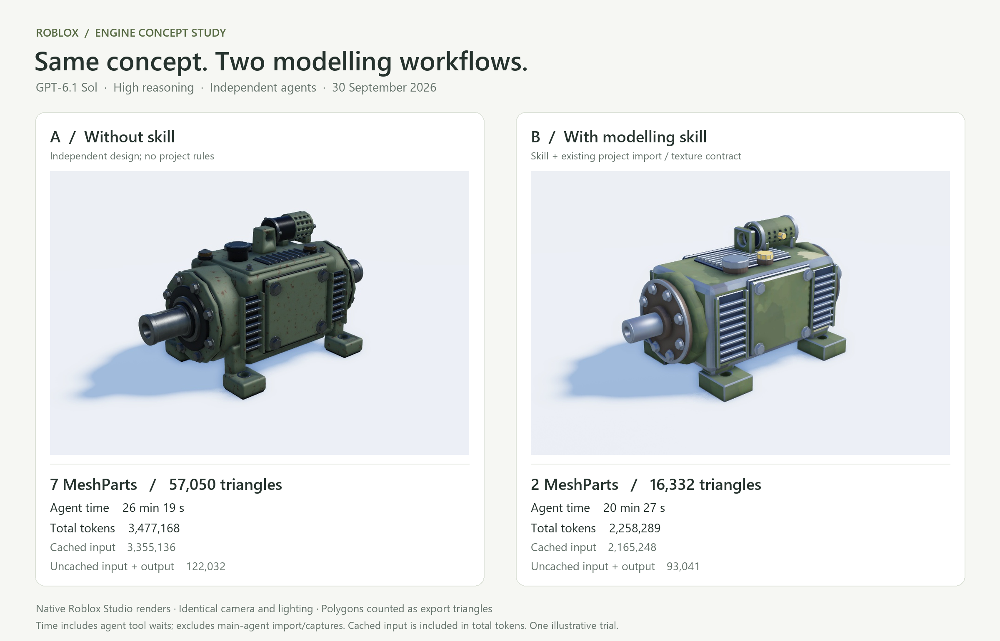

# Roblox Blender Modelling

An agent skill for creating and repairing Blender assets destined for Roblox, with particular attention to **UV scale and distortion** and **exporting only meaningful motion groups**.

## Engine comparison: with and without the skill

Two independent **GPT-6.1 Sol** agents, both using **high** reasoning, built an engine from the same generated concept. A was instructed to work without modelling skills or project rules. B followed this modelling skill and the project's texture/import contract. Both final models were imported through the official Roblox Blender add-on.



[Printable comparison sheet (PDF)](assets/engine-comparison/comparison-sheet.pdf) · Original Roblox captures: [A](assets/engine-comparison/engine-a-roblox.png), [B](assets/engine-comparison/engine-b-roblox.png).

| Metric | A — without skill | B — with skill |
| --- | ---: | ---: |
| Separate visible MeshParts in Roblox | 7 | 2 |
| Polygons, measured as exported triangles | 57,050 | 16,332 |
| Agent elapsed time | 26 min 19 s | 20 min 27 s |
| Total tokens, including cached input | 3,477,168 | 2,258,289 |
| Cached input tokens | 3,355,136 | 2,165,248 |
| Uncached input + output tokens | 122,032 | 93,041 |
| Output tokens, including reasoning | 24,949 | 21,335 |

These are separate native Roblox Studio Edit captures with the same three-quarter camera, scale, lighting and background. The comparison sheet only crops and lays out those captures; it does not repaint the models. Triangle counts come from the final evaluated Blender export groups; MeshPart counts were verified after installation in Roblox.

Elapsed time is each agent's wall time, including tool waits. It excludes the main agent's asset publication, installation and comparison captures. Token totals are cumulative input plus output and include repeated context; cached input is already included in the total. The uncached row is a token count, not a monetary cost. [Machine-readable results](assets/engine-comparison/results.json) contain the exact durations and token breakdown.

This is one illustrative pair from **2026-09-30**, with different instruction and texture-reuse constraints. It is not a controlled benchmark, an FPS measurement or gameplay acceptance.

## What changes the workflow

- Measure texel density in real units and directional stretching, including object scale and rectangular textures.
- Plan intentional UV stacking; preserve directional artwork, seams, normal detail and filtering margins.
- Merge stationary construction pieces into one mesh per rigid transform. Keep independent motion independent.
- Weld a designed continuous road, ramp or loop instead of exporting every generator segment.
- Publish a unique mesh prototype once and verify actual MeshId reuse after installation.
- Keep the project's official Roblox Blender add-on, native collision and Script Sync contracts authoritative.

Texture atlases are supported when the project uses them. The skill does not prescribe an atlas as the solution to poor UV mapping.

## Install

Using the Agent Skills CLI:

```sh
npx skills add WildCake/roblox-blender-modelling
```

Or copy this repository's skill files into your agent's `roblox-blender-modelling` skill directory. Keep `SKILL.md`, `agents/`, `references/`, `scripts/`, `UPSTREAM.md` and the license notices together.

Example request:

> Use roblox-blender-modelling to repair this vehicle's texture scale and stretched UVs, preserve intentional repeated-island stacking, and prepare one exported mesh for each actual rigid motion group. Follow the project specifications and the official Roblox Blender add-on pipeline.

The skill follows project-specific texture, collision, mass and asset budgets. It does not authorize uploading assets, desktop control, gameplay tests or subagents by itself.

## Optional numerical tools

- [`uv_metrics.py`](scripts/uv_metrics.py): physical pixel density and directional distortion from evaluated geometry. It checks invalid/collapsed UVs and configured thresholds. Explicit uniform-colour face exemptions are supported.
- [`check_export.py`](scripts/check_export.py): prepared export collection versus a motion-group plan, unnecessary segmentation, triangle/material/UV budgets and connected topology for continuous surfaces.

Both tools run in background Blender, write a JSON report and do not save the source. Use `--python-exit-code 2` before `--python` so a failed gate returns a failing process status. Detailed examples and the report limits are in the references.

The UV tool does not certify island overlap, seam appearance, artwork orientation or padding. The export tool does not prove actual motion, uploaded identity or native Roblox collision. Those responsibilities remain in the workflow.

## Validation

Tested with **Blender 5.2.1 LTS**: 14 isolated numerical fixture tests, including area-preserving UV distortion, physical/object scale, rectangular textures, explicit uniform-colour exemptions, extra export objects, needless segmentation and unwelded continuous seams. CLI failures and source-file immutability are also checked. No renders or gameplay tests are part of this suite.

```sh
blender --background --factory-startup --python-exit-code 2 --python scripts/test_checks.py
```

The tests create and remove only their own temporary fixtures. They refuse to run outside background mode. Results establish the named script behaviours, not visual quality for arbitrary assets or compatibility with every Blender version.

## Origin and license

Built from an existing Roblox/Blender modelling workflow and selected ideas from [Majid Manzarpour's Blender Game Skills](https://github.com/majidmanzarpour/blender-game-skills). The Roblox-specific UV and export checks are new implementations. The adaptation deliberately excludes generic collision-proxy collections, multi-material fragmentation and game-engine budgets that do not match Roblox.

MIT licensed. See [UPSTREAM.md](UPSTREAM.md) for the pinned upstream version, attribution and retained license notice. This is an independent community skill.
